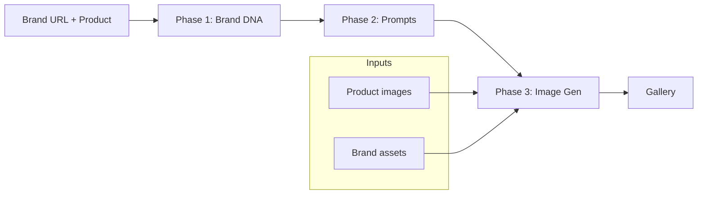

# Static Ad Generator

AI-powered ad studio for generating production-ready static ad creatives for **DTC product brands** and **SaaS/service brands**. The web dashboard handles brand research, prompt authoring, asset management, and image generation in a single workflow — backed by a Python pipeline and 40+ battle-tested ad templates.


---

## Features

- **End-to-end pipeline** — Brand research → prompt generation → image generation, all from one dashboard
- **Two brand tracks** — Product (physical goods) and Service (SaaS, apps, digital products) with tailored templates and asset requirements
- **40+ ad templates** — Headlines, offers, social proof, UI hero shots, integration grids, and more
- **Live generation terminal** — Stream pipeline output with progress estimates via Server-Sent Events
- **Asset-aware eligibility** — Service brands show which templates are ready, partial, or blocked based on uploaded assets
- **Gallery & export** — Browse generated creatives grouped by template, with inline prompt editing
- **Multi-user ready** — Google OAuth, per-user quotas, and storage limits for shared deployments
- **CLI fallback** — Full pipeline also runnable from the command line for automation and Claude Code workflows

---

## How It Works



| Phase | What happens | Output |
|-------|--------------|--------|
| **1 — Brand DNA** | Researches the brand via web scraping and LLM analysis | `brands/{brand}/brand-dna.md` |
| **2 — Prompts** | Fills 40 template prompts with brand-specific copy and visual direction | `brands/{brand}/prompts.json` |
| **3 — Generate** | Sends prompts to an image model with reference assets attached | `brands/{brand}/outputs/{template}/` |

---

## Tech Stack

| Layer | Technologies |
|-------|-------------|
| **Frontend** | Next.js 16, React 19, Tailwind CSS 4, Lucide icons |
| **Auth** | NextAuth v5 (Google OAuth) |
| **Pipeline** | Python 3.11 — Playwright, Anthropic/Gemini/OpenRouter APIs |
| **Image models** | Gemini (private) or Grok Imagine via OpenRouter (public) |

---

## Prerequisites

- **Node.js** 20+
- **Python** 3.11 with [Conda](https://docs.conda.io/) (recommended)
- **Google Cloud OAuth credentials** for dashboard login
- **API keys** depending on deployment mode (see [Configuration](#configuration))

---

## Installation

### 1. Clone and install dependencies

```bash
git clone <repository-url>
cd static-ad-generator

npm install
```

### 2. Set up the Python environment

```bash
conda env create -f environment.yml
conda activate static-ad-generator

# Install Playwright browsers (required for Phase 1 web scraping)
playwright install chromium
```

### 3. Configure environment variables

Create `env/.env.local` (this path is gitignored). See [Configuration](#configuration) for all required variables.

### 4. Start the development server

```bash
npm run dev
```

Open [http://localhost:3000](http://localhost:3000) and sign in with Google.

---

## Configuration

Environment variables are loaded from `env/.env.local` at build and runtime via `next.config.ts`.

### Required

| Variable | Description |
|----------|-------------|
| `AUTH_SECRET` | Session encryption secret — generate with `npx auth secret` |
| `AUTH_GOOGLE_ID` | Google OAuth client ID |
| `AUTH_GOOGLE_SECRET` | Google OAuth client secret |

### Image generation (choose one mode)

Set `PUBLIC_VERSION=true` for the free OpenRouter stack, or omit/set to `false` for the private Gemini stack.

| Variable | Public mode | Private mode |
|----------|-------------|--------------|
| `PUBLIC_VERSION` | `true` | `false` or unset |
| `OPENROUTER_API_KEY` | Required | — |
| `GOOGLE_API_KEY` | — | Required |
| `ANTHROPIC_API_KEY` | — | Required (Phase 1 & 2) |

Get API keys:

- Google AI Studio: [aistudio.google.com/apikey](https://aistudio.google.com/apikey)
- OpenRouter: [openrouter.ai/keys](https://openrouter.ai/keys)
- Anthropic: [console.anthropic.com](https://console.anthropic.com/)

### Optional — quota limits

Tune resource limits for shared deployments. Defaults are conservative for a small VPS.

| Variable | Default | Description |
|----------|---------|-------------|
| `LIMIT_MAX_BRANDS_PER_USER` | `2` | Brands per authenticated user |
| `LIMIT_MAX_STORAGE_MB_PER_USER` | `40` | Disk quota per user |
| `LIMIT_MAX_RESEARCH_PER_DAY` | `1` | Brand DNA runs per user per day |
| `LIMIT_MAX_GENERATE_PER_DAY` | `3` | Image generation runs per user per day |
| `LIMIT_MAX_TEMPLATES_PER_GENERATE` | `3` | Templates per generation run |
| `LIMIT_MAX_VARIATIONS` | `2` | Variations per template |
| `LIMIT_MAX_UPLOAD_MB` | `4` | Max upload file size |

---

## Usage

### Web dashboard

1. **Sign in** at `/login` with your Google account.
2. **Create a brand** — Enter name, URL, product/plan, and type (Product or Service).
3. **Upload assets**
   - *Product brands:* drop images in `product-images/`
   - *Service brands:* upload screenshots, logos, team photos, and icons via the dashboard
4. **Run Brand DNA** — Phase 1 researches the brand and writes `brand-dna.md`.
5. **Generate prompts** — Phase 2 fills all eligible templates into `prompts.json`.
6. **Generate ads** — Select templates, resolution, and variations; watch live output in the terminal tab.
7. **Review** — Browse results in the Gallery tab.

### Command line

The full pipeline can also be run directly for scripting or Claude Code workflows. See [`usage.md`](usage.md) for detailed CLI instructions, cost estimates, and brand setup guides.

Quick reference:

```bash
# Preview a generation run (no API calls)
python skills/references/generate_ads.py --brand lmnt --type product --dry-run

# Generate all templates
python skills/references/generate_ads.py --brand lmnt --type product

# Service brand — check asset eligibility before generating
python skills/references/generate_ads.py --brand appmakelaar --type service --recommend
```

For Claude Code integration, see [`skills/SKILL.md`](skills/SKILL.md).

---

## Project Structure

```
static-ad-generator/
├── src/
│   ├── app/                  # Next.js App Router (dashboard, login, API routes)
│   ├── components/           # UI components (sidebar, gallery, template grid)
│   ├── lib/                  # Brand filesystem, quotas, pipeline helpers
│   ├── auth.ts               # NextAuth configuration
│   └── middleware.ts         # Route protection
├── brands/
│   └── {brand-name}/
│       ├── brand-dna.md      # Generated brand identity document
│       ├── prompts.json      # Generated ad prompts
│       ├── brand-meta.json   # Ownership and metadata
│       ├── product-images/   # Product brand assets
│       ├── brand-assets/     # Service brand assets (screenshots, logos, …)
│       └── outputs/          # Generated ad images (gitignored)
├── skills/
│   ├── SKILL.md              # Claude Code skill definition
│   └── references/           # Python pipeline scripts and templates
├── env/
│   └── .env.local            # Secrets and config (gitignored)
├── environment.yml           # Conda environment spec
└── usage.md                  # Detailed CLI usage guide
```

---

## API Routes

| Route | Method | Description |
|-------|--------|-------------|
| `/api/brands` | GET, POST | List/create brands |
| `/api/brands/upload` | POST | Upload brand assets |
| `/api/brands/prompts` | GET, POST | Read/update prompts |
| `/api/brands/recommend` | GET | Template eligibility for service brands |
| `/api/pipeline/run` | GET (SSE) | Run research or generate pipeline |
| `/api/pipeline/status` | GET | Check if a pipeline is running |
| `/api/images` | GET | Serve generated images |
| `/api/usage` | GET | Current user quota and limits |

All routes except `/api/images` and `/api/auth/*` require authentication.

---

## Cost Reference

Approximate per-image costs on the private Gemini stack:

| Resolution | Cost/image | Best for |
|------------|------------|----------|
| 512 / 1K | ~$0.07 | Quick tests, drafts |
| 2K | ~$0.10 | Production (default) |
| 4K | ~$0.15 | Hero assets |

A full run (40 templates × 4 variations at 2K) costs roughly **$16**. Use `--templates` and `--resolution 1K` to reduce cost during iteration.

The public OpenRouter stack is free but limited to 512/1K resolution and lower daily quotas.

---

## Scripts

```bash
npm run dev      # Start development server
npm run build    # Production build
npm run start    # Start production server
npm run lint     # Run ESLint
```

---

## Deployment Notes

- Ensure Python 3.11 and the conda environment are available on the server — the API spawns Python child processes for pipeline runs.
- Set all environment variables in `env/.env.local` or inject them into the host environment before starting Next.js.
- Configure Google OAuth redirect URIs for your production domain.
- Generated images live under `brands/*/outputs/` — plan disk space accordingly (`LIMIT_MAX_GLOBAL_STORAGE_MB` defaults to 150 MB).

---

## License

Private project. All rights reserved.
